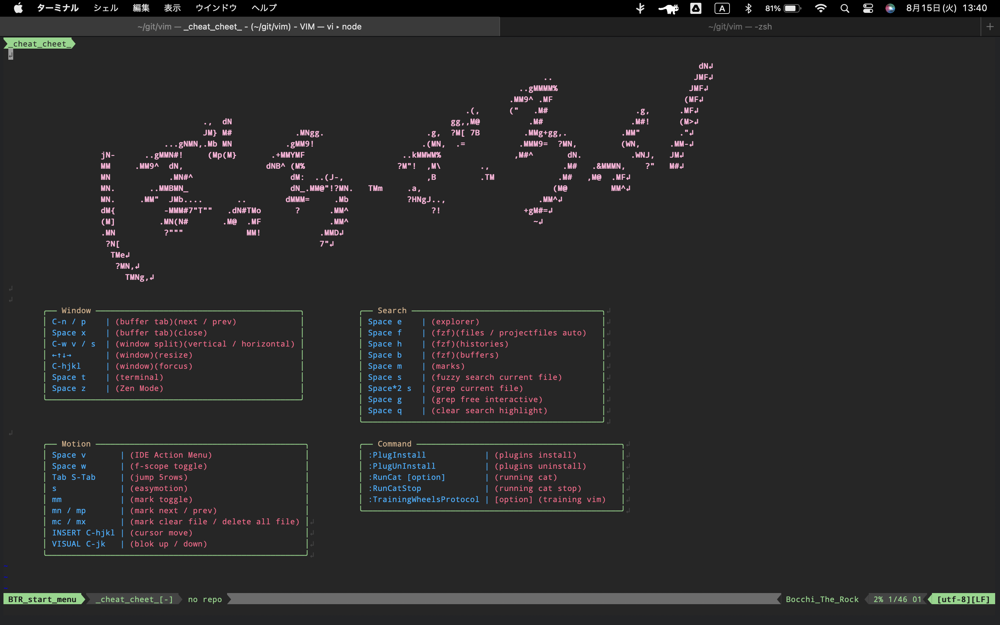

# Demo (only vimrc)


# Dependencies
- vim 8.2~

# Plugin's Dependencies
if install plugins by `:PlugInstall` command, need here.<br>
alse see [Install_Plugins](#install_plugins)

|plugins|dependencies|
|--|--|
|[coc.nvim](https://github.com/neoclide/coc.nvim)|<ul><li>[node.js](https://github.com/nodejs/node)<li>yarn: `npm install -g yarn`<li>[fzf](https://github.com/junegunn/fzf)|
|language server with coc|see [here](https://github.com/neoclide/coc.nvim/wiki/Language-servers)|
|[vimspector](https://github.com/puremourning/vimspector)|Vim 8.2 Huge build compiled with Python 3.10 or later<br>※also see [here](https://github.com/puremourning/vimspector#dependencies)|
|[github/copilot.vim](https://github.com/github/copilot.vim)|[GitHub Copilot](https://github.com/github-copilot/signup)|
|[CoderCookE/vim-chatgpt](https://github.com/CoderCookE/vim-chatgpt)|https://platform.openai.com/account/api-keys|

# Recommendation commands / packages
|command / package|purpose|use in vim if include|
|--|--|--|
|[lazygit](https://github.com/jesseduffield/lazygit)|GUI git operations|<ul><li>[x] </ul>|
|[bat](https://github.com/sharkdp/bat)|syntaxed preview in coc fzf (references/outline)|<ul><li>[x] </ul>|
|[powerline/fonts](https://github.com/powerline/fonts)|font|<ul><li>[x] </ul>|
|[ryanoasis/nerd-fonts](https://github.com/ryanoasis/nerd-fonts)|font|<ul><li>[x] </ul>|
|[ryanoasis/vim-devicons](https://github.com/ryanoasis/vim-devicons)|icon|<ul><li>[x] </ul>|

# Installation

## 1. get vim 8.2~
```sh
brew install vim
```
or
```sh
git clone --depth 1 https://github.com/vim/vim.git \
&& cd vim && ./configure --with-features=huge --enable-python3interp=dynamic \
&& sudo make && sudo make install \
&& vim --version
```

## 2. get this vimrc
```sh
git clone --depth 1 https://github.com/serna37/vim && ln -s vim/.vimrc ~/.vimrc
```
or
```sh
curl https://raw.githubusercontent.com/serna37/vim/master/.vimrc > ~/.vimrc
```

## 3. [optional] execute command on vim
```
:PlugInstall
```
other commands / keymaps details are in cheat sheet.<br>
※ I chose yapf for python formatter, so need `python -m pip install yapf`

## 4. [optional] setup [copilot](https://github.com/github/copilot.vim)
```
:Copilot setup
```
※ Needs [GitHub Copilot](https://github.com/github-copilot/signup)

# How to use
When you start vim with no args like
```
vim
```
You can see cheat sheet on start menu. This is here.


also see [wiki-debug](https://github.com/serna37/vim/wiki/Debug)

# Install_Plugins
`:PlugInstall` command install these plugins.
- [neoclide/coc.nvim](https://github.com/neoclide/coc.nvim)
- [puremourning/vimspector](https://github.com/puremourning/vimspector)
- [github/copilot.vim](https://github.com/github/copilot.vim)
- [CoderCookE/vim-chatgpt](https://github.com/CoderCookE/vim-chatgpt)

# Inspired Plugins (no install)
this `vimrc` including functions inspired these plugins.
- [simeji/winresizer](https://github.com/simeji/winresizer)
- [jiangmiao/auto-pairs](https://github.com/jiangmiao/auto-pairs)
- [tpope/vim-surround](https://github.com/tpope/vim-surround)
- [vim-airline/vim-airline](https://github.com/vim-airline/vim-airline)
- [junegunn/fzf.vim](https://github.com/junegunn/fzf.vim)
- [junegunn/fzf](https://github.com/junegunn/fzf)
- [preservim/nerdtree](https://github.com/preservim/nerdtree)
- [yuttie/comfortable-motion.vim](https://github.com/yuttie/comfortable-motion.vim)
- [easymotion/vim-easymotion](https://github.com/easymotion/vim-easymotion)
- [unblevable/quick-scope](https://github.com/unblevable/quick-scope)
- [t9md/vim-quickhl](https://github.com/t9md/vim-quickhl)
- [MattesGroeger/vim-bookmarks](https://github.com/MattesGroeger/vim-bookmarks)
- [junegunn/goyo.vim](https://github.com/junegunn/goyo.vim)
- [mhinz/vim-startify](https://github.com/mhinz/vim-startify)
- [markonm/traces.vim](https://github.com/markonm/traces.vim)
- [thinca/vim-quickrun](https://github.com/thinca/vim-quickrun)
- [joshdick/onedark.vim](https://github.com/joshdick/onedark.vim)

# Original
this `vimrc` including these functions.
- Running Cat
- Popup terminal/git
- Tab Anchor
- Fuzzy Search Current File
- Grep Current File
- Grep Recursive Interactive
- IDE menu
- Completion
- PlugInstall / PlugUnInstall
- Training Wheels Protocol
